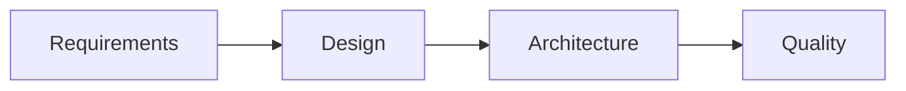

# CLAUDE.md

This file provides comprehensive guidance to Claude Code (claude.ai/code) when working with the Locusify codebase.

## 🎯 Project Overview

**Locusify** is an intelligent travel tool—upload raw photos, get auto visual route maps and seamless, essence-capturing vlogs.

### Technical Architecture

**Frontend Tech Stack:**

- React 19 - Latest React version with Compiler
- TypeScript - Complete type safety
- Vite - Modern build tool
- Tailwind CSS - Atomic CSS framework
- Radix UI - Accessible component library
- Zustand - State management
- TanStack Query - Data fetching and caching
- React Router 7 - Routing management
- i18next - Internationalization

**Project Structure:**

```
Locusify/                     # React application with web support
├── app/                      # application directory
├── packages/                 # Monorepo packages for modular architecture
│   ├── core/                 # Core utilities and shared functionality
│   ├── image-processor/      # Image processing and analysis
│   ├── share/                # Sharing and export functionality
│   ├── track/                # Route tracking and mapping
│   └── vlog/                 # Vlog generation and editing
├── .claude/                  # Claude Code configuration
├── PRPs/                     # Product Requirements and Progress docs
└── README.md                # Project overview
```

## ⚙️ Claude Code Configuration

### Specialized Agent System

The project leverages Claude Code's multi-agent architecture for domain-specific expertise:

#### Available Agents (`/.claude/agents/`)

| Agent                  | Role                | Primary Responsibilities                                        |
| ---------------------- | ------------------- | --------------------------------------------------------------- |
| **product-manager**    | Strategy & Planning | Requirements analysis, PRP generation |
| **ui-ux-designer**     | Design & UX         | User experience, design systems        |
| **frontend-developer** | Implementation      | React web architecture, cross-platform optimization     |
| **code-reviewer**      | Quality Assurance   | Security analysis, performance review, production readiness     |

#### Available Commands (`/.claude/commands/`)

**Primary Workflow:**
```bash
/workflow <feature-name> [priority]
```

## 🔄 Development Workflow

### Feature Development Process

Use the standardized 4-stage workflow for all new features:



#### Stage Details

| Stage                | Agent                | Deliverables                                              |
| -------------------- | -------------------- | --------------------------------------------------------- |
| **1. Requirements**  | `@product-manager`    | PRP documents, user stories, acceptance criteria          |
| **2. Design**        | `@ui-ux-designer`     | Wireframes, UI mockups, interaction flows                 |
| **3. Architecture**  | `@frontend-developer` | Technical specs, web deployment, API design, data models  |
| **4. Quality**       | `@code-reviewer`      | Testing strategy, security review, performance benchmarks |

**Automation:** All PRPs saved to `/PRPs/[YYYY-MM-DD]/` with structured documentation and automatic progress tracking.

### PRP Documentation Structure

Each workflow execution creates a date-based folder with comprehensive documentation:

```
/PRPs/[YYYY-MM-DD]/                        # Date-based folder
├── [feature-name]-progress.md             # Progress tracking document (auto-generated)
├── [feature-name]-prd.md                  # Product requirements
├── [feature-name]-design.md               # Design specifications
├── [feature-name]-tech.md                 # Technical architecture
└── [feature-name]-qa.md                   # Quality assurance
```

**Progress Tracking Features:**
- Automatic creation of progress tracking document
- Real-time status updates with ⏳/✅/❌ indicators
- Stage-by-stage task completion tracking
- User confirmation required for each stage execution
- Dependency tracking between workflow stages

### Code Quality Standards

#### Before Implementation
- [ ] PRP approved and documented in `/PRPs/[YYYY-MM-DD]/`
- [ ] Design mockups and user flows completed
- [ ] Technical architecture reviewed
- [ ] Security and privacy considerations addressed

#### During Development
- [ ] Follow TypeScript strict mode with proper type definitions
- [ ] Use Tailwind CSS for consistent, responsive design patterns
- [ ] Use Radix UI for consistent UI components
- [ ] Implement Zustand stores for state management
- [ ] Use TanStack Query for data fetching and caching
- [ ] Add comprehensive error handling with proper TypeScript types
- [ ] Set up i18next for internationalization support
- [ ] Write unit tests for core logic and components

#### After Implementation
- [ ] Code review with security focus
- [ ] Performance testing and optimization
- [ ] Cross-platform compatibility verification (web, mobile)
- [ ] Documentation updated

## 🛠 Development Standards

### Package Management

**pnpm Commands:**
```bash
# Install all dependencies
pnpm install

# Development commands
pnpm dev                # Start Vite development server
pnpm build              # Build for production
pnpm preview            # Preview production build
pnpm lint               # Run ESLint
pnpm test               # Run Vitest tests
pnpm type-check         # Run TypeScript type checking

# Add dependencies
pnpm add <package-name>
pnpm add -D <dev-package-name>
```
