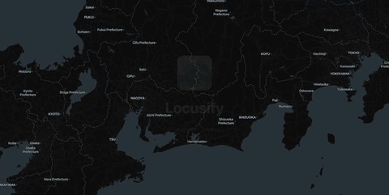

<p align="center">
  
</p>

<h1 align="center">Locusify</h1>

<p align="center">
  Turn your GPS-tagged travel photos into interactive route maps and cinematic journey replays — instantly, privately, for free.
</p>

<p align="center">
  <a href="https://locusify.caterpi11ar.com" target="_blank"><strong>🌐 Try it Live</strong></a>
  &nbsp;·&nbsp;
  <a href="https://www.producthunt.com/products/locusify" target="_blank">Product Hunt</a>
  &nbsp;·&nbsp;
  <a href="README.zh-CN.md">中文</a>
</p>

<p align="center">
  <a href="https://www.producthunt.com/products/locusify"></a>
  
  
  
  
</p>

---

## What is Locusify?

**Locusify** is a free, browser-based travel app that transforms GPS-tagged photos into interactive route maps and animated journey replays. It reads the GPS coordinates embedded in each photo's EXIF metadata, plots them on an interactive map, and lets you replay your journey as a cinematic video — all processed locally on your device, with no photos or location data ever uploaded to a server.

---

## Demo

<p align="center">
  
</p>

---

## Try on Mobile

Locusify is fully optimized for mobile browsers. Scan the QR code to try it on your phone:

<p align="center">
  
</p>

---

## How It Works

1. **Upload** your GPS-tagged travel photos (JPG, PNG, HEIC, WebP, AVIF)
2. **Extract** — Locusify reads GPS coordinates from each photo's EXIF data, right in your browser
3. **Visualize** — an interactive map plots your route with photo markers, clusters, and an animated trajectory line
4. **Replay** — watch your journey play back in chronological order, then export and share it as an MP4 video

---

## Features

- **GPS Photo Mapping** — Automatically extracts location data from EXIF metadata and plots photos on an interactive map
- **Trajectory Replay** — Timeline-based animated route playback with smooth camera follow and adjustable speed
- **Video Export & Share** — Record your journey replay as an MP4 video, then download or share it directly
- **Photo Clusters** — Automatically groups nearby photos at higher zoom levels to keep the map clean
- **100% Local Processing** — All photo parsing and map rendering happens in your browser; nothing is uploaded
- **Drag-and-Drop Upload** — Upload multiple photos at once with automatic GPS validation
- **Multi-language** — Available in English and Chinese (中文)
- **Dark / Light Mode** — Respects your system preference, or switch manually

---

## Privacy

Locusify is built privacy-first:

| What we do | What we don't do |
|------------|-----------------|
| Process all photos locally in your browser | Upload your photos to any server |
| Use GPS data only for map display, in-session | Store or share your location data |
| Use anonymous page-view analytics (Google Analytics) | Collect personal information or sell data |

Your photos never leave your device. Close the browser tab and they're gone.

---

## Who Is Locusify For?

- **Solo travelers** who want to visualize and remember exactly where they went
- **Travel photographers** who shoot hundreds of geotagged photos and want to see the full picture
- **Vloggers and content creators** who want a quick, beautiful route replay video without video editing software
- **Anyone** who has ever wondered "where exactly did I go on that trip?"

---

## Frequently Asked Questions

**What is GPS photo mapping?**
GPS photo mapping is the process of reading the geographic coordinates (latitude and longitude) embedded in a photo's EXIF metadata and displaying the photo's location on a map. Most smartphones automatically tag photos with GPS data when location access is enabled.

**Does my phone camera take GPS-tagged photos?**
Most modern smartphones (iPhone, Android) embed GPS coordinates in photos by default when location permissions are granted for the Camera app. Photos taken with standalone cameras may not have GPS data unless you use a GPS logger or a camera with built-in GPS.

**Does Locusify upload my photos to a server?**
No. All processing — GPS extraction, map rendering, trajectory calculation, and video export — happens entirely in your browser using JavaScript. Your photos are never sent to any server.

**What photo formats does Locusify support?**
Locusify supports JPG, PNG, HEIC, WebP, and AVIF. At least 2 photos with valid GPS data are required to generate a trajectory.

**How many photos do I need?**
You need at least 2 photos with GPS coordinates to generate a route. There's no hard upper limit, though very large batches (500+ photos) may require more processing time depending on your device.

**Is Locusify free?**
Yes. Locusify is completely free with no accounts, no subscriptions, and no feature paywalls.

**Can I export my journey as a video?**
Yes. After viewing the trajectory replay, you can record the playback and download or share it as an MP4 video.

**What if some of my photos don't have GPS data?**
Locusify validates GPS data during upload and clearly marks which photos have location data and which don't. Photos without GPS are excluded from the trajectory but you can still see them listed.

---

## Roadmap

- [x] GPS photo mapping and interactive map view
- [x] Trajectory replay with animation controls
- [x] Video export (MP4)
- [x] Photo clustering
- [x] Dark mode + multi-language
- [ ] Trip history — save and revisit past journeys
- [ ] Multi-trip view — display multiple trips on a single map
- [ ] AI transitions — intelligent scene-aware transitions between photos during trajectory replay
- [ ] AI video generation — automatically produce cinematic travel vlogs with smart editing, pacing, and storytelling

---

## Tech Stack

| Category | Technology |
|----------|-----------|
| Framework | React 19 |
| Language | TypeScript |
| Build Tool | Vite 7 |
| Styling | Tailwind CSS 4 |
| Map | MapLibre GL |
| State Management | Zustand |
| Data Fetching | TanStack Query |
| Animation | Motion |
| UI Primitives | Radix UI |
| GPS Extraction | exifr |

---

## Getting Started (Development)

### Prerequisites

- Node.js >= 22
- pnpm >= 10

### Setup

```bash
# Clone the repository
git clone https://github.com/caterpi11ar/locusify.git
cd locusify

# Install dependencies
pnpm install

# Start the development server
pnpm dev
```

### Available Scripts

| Command | Description |
|---------|-------------|
| `pnpm dev` | Start Vite development server |
| `pnpm build` | Build for production (tsc + vite build) |
| `pnpm preview` | Preview production build |
| `pnpm lint` | Run ESLint with auto-fix |
| `pnpm typecheck` | Run TypeScript type checking |

### Project Structure

```
src/
├── assets/          # Static assets
├── components/      # Shared UI components (shadcn/ui)
├── hooks/           # Custom React hooks
├── layout/          # Layout components
├── lib/             # Utility libraries
├── locales/         # i18n translations (en, zh-CN)
├── pages/
│   ├── explore/     # Explore page
│   ├── map/         # Map page + trajectory replay
│   ├── settings/    # Settings (language, theme, privacy)
│   └── splashScreen/# Splash / landing screen
├── routers/         # Route definitions
└── types/           # TypeScript type definitions
```

---

## License

[ISC](LICENSE) © caterpi11ar

