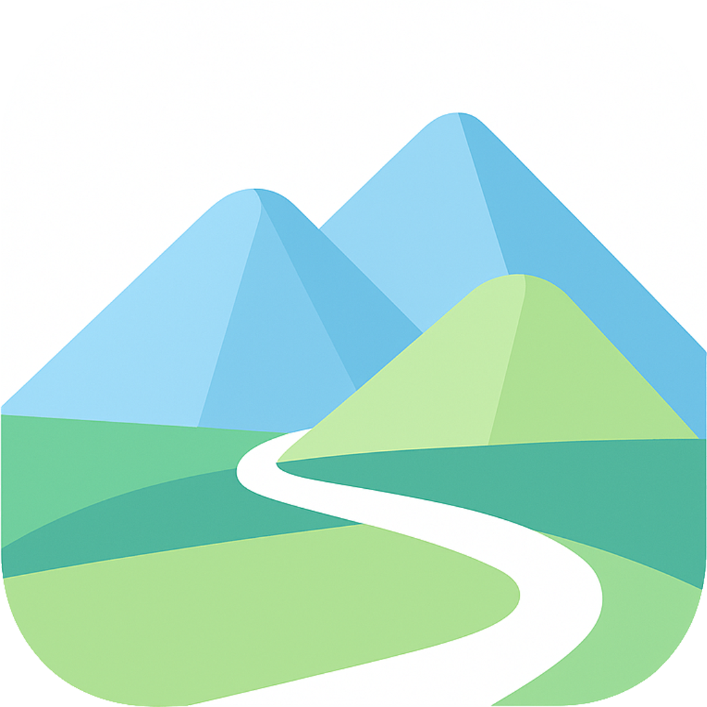

# Locusify

An intelligent travel tool—upload raw photos, get auto visual route maps and seamless, essence-capturing vlogs.

## Key Features
- **Auto-Generated Travel Routes**: Extracts GPS data from your photos to plot a visual trajectory of your trip, so you can relive your journey step-by-step.
- **Smart Vlog Creation**: Automatically arranges photos by time and location, adds smooth transitions, and generates a ready-to-share vlog—saving you hours of manual editing.
- **Metadata-Powered Accuracy**: Ensures photos are ordered correctly and mapped to their exact real-world locations.
- **One-Click Sharing**: Export your vlog directly to popular social platforms to share your travels with friends and family.

## How to Use
1. **Capture Photos with GPS**: When taking travel photos, ensure your device's GPS is enabled—this lets Locusify access location data later.
2. **Launch Locusify**: Open the app on your device (compatible with PC and mobile).
3. **Upload Your Photos**: Select and upload the travel photos you want to include in your vlog (supports JPG, PNG, and HEIC formats).
4. **Wait for Processing**: The app will automatically analyze your photos, map your route, and compile the vlog (processing time depends on the number of photos).
5. **View & Share**: Preview your generated vlog, make quick tweaks if needed, and share it to your favorite platforms.

## Get Started
Ready to turn your travel memories into a shareable vlog? Download Locusify today (available on the App Store, Google Play, and web) and start preserving your adventures in a whole new way!

*Happy wandering, and happy vlogging!*