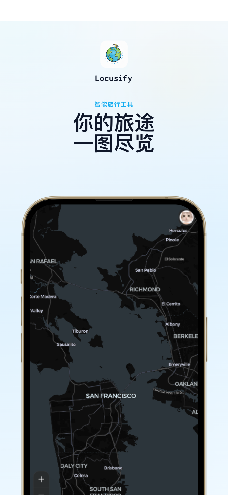
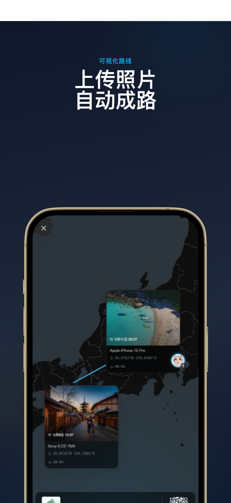
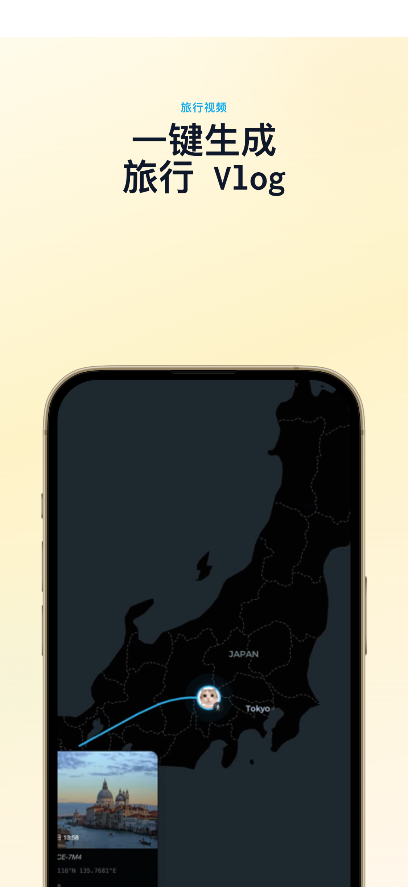

<p align="center">
  
</p>

<h1 align="center">Locusify</h1>

<p align="center">
  上传带 GPS 的旅行照片，自动生成交互路线地图和电影感行程回放视频——即时、私密，提供免费和付费套餐。
</p>

<p align="center">
  <a href="https://locusify.caterpi11ar.com" target="_blank"><strong>🌐 在线体验</strong></a>
  &nbsp;·&nbsp;
  <a href="https://www.producthunt.com/products/locusify" target="_blank">Product Hunt</a>
  &nbsp;·&nbsp;
  <a href="README.md">English</a>
</p>

<p align="center">
  <a href="https://www.producthunt.com/products/locusify"></a>
  
  
  
  
</p>

---

## Locusify 是什么？

**Locusify** 是一款旅行工具，能将带 GPS 信息的照片自动转换为交互式路线地图和动态行程回放视频。它从照片的 EXIF 元数据中读取地理坐标，在地图上绘制出完整的旅行轨迹，并支持录制为视频导出——所有照片处理均在你的设备本地完成，照片和位置数据永远不会上传到任何服务器。

---

## 产品展示

<p align="center">
  
  &nbsp;
  
  &nbsp;
  
  &nbsp;
  
</p>

---

## 工作原理

1. **上传** 带 GPS 的旅行照片（支持 JPG、PNG、HEIC、WebP、AVIF）
2. **解析** — Locusify 读取每张照片 EXIF 中的 GPS 坐标
3. **可视化** — 交互式地图自动绘制路线，含照片标记、聚合点和轨迹动画
4. **回放** — 按时间顺序动态播放行程，可录制导出为视频并一键分享

---

## 核心功能

- **GPS 照片上图** — 自动提取 EXIF 位置信息，将照片标注在地图上
- **轨迹回放** — 基于时间线的动态路线回放，支持摄像机跟随与速度调节
- **视频导出与分享** — 录制回放过程，导出为视频并支持直接分享
- **照片聚合** — 在较低缩放级别自动合并邻近照片，保持地图整洁
- **100% 本地处理** — 所有解析与渲染均在设备本地完成，无需上传
- **拖放上传** — 批量上传并自动验证 GPS 数据
- **多语言** — 支持中文（简体）和英文
- **右键 / 长按添加照片** — 在地图任意位置右键（桌面端）或长按（移动端）即可将照片添加到该坐标，即使照片不含 GPS 数据
- **深色 / 浅色模式** — 跟随系统主题或手动切换
- **账号与身份验证** — 支持 Google、GitHub 或邮箱（OTP 或密码）登录；账号可跨设备同步订阅状态

---

## 隐私说明

Locusify 以隐私优先为核心设计原则：

| 我们做的事 | 我们不做的事 |
|-----------|-------------|
| 在设备本地处理所有照片 | 将照片上传至任何服务器 |
| 位置数据仅用于本次会话的地图显示 | 存储或分享你的地理位置 |
| 使用匿名页面访问统计（Google Analytics）改善产品 | 收集个人信息或出售数据 |
| 同步你的账号资料和订阅状态 | 上传你的照片或位置数据 |

---

## 适合哪些用户？

- **独自旅行者** — 想回顾自己走过的每一段路
- **旅行摄影师** — 拍摄了大量 GPS 照片，想快速看到完整路线
- **Vlogger / 内容创作者** — 想快速生成路线回放视频，无需视频剪辑软件
- **任何人** — 曾经想知道"我那次旅行究竟去了哪里"

---

## 竞品对比

| 特性 | Locusify | [Travel Animator](https://www.travelanimator.com/) | [Polarsteps](https://www.polarsteps.com/) |
|------|----------|-----------------|------------|
| 平台 | Web / Android / iOS | 移动 App | 移动 App + Web |
| 价格 | 免费 / Pro / Max | 免费 + PRO 付费 | 免费 + 付费旅行书 |
| 路线来源 | 照片 EXIF（自动提取） | 手动绘制 / GPX / Google Maps | 实时 GPS 追踪 |
| 视频导出 | 视频回放 | 4K 动画路线视频 | 无 |
| 隐私 | 100% 本地处理 | 云端处理 | 云端处理 |
| AI 功能 | 规划中（转场、Vlog） | 无 | 无 |
| 地图样式 | MapLibre GL | 30+ 样式，平面 + 地球仪 | 内置样式 |
| 3D 模型 | — | 250+ 交通工具 | — |
| 是否需要注册 | 是 | 是 | 是 |

---

## 常见问题

**什么是 GPS 照片上图？**
GPS 照片上图是指读取照片 EXIF 元数据中嵌入的地理坐标（纬度和经度），并将照片位置显示在地图上的过程。大多数智能手机在开启位置权限后，会自动为照片标记 GPS 信息。

**我的手机拍的照片有 GPS 信息吗？**
大多数现代智能手机（iPhone、Android）在相机 App 获得位置权限的情况下，会默认将 GPS 坐标嵌入照片。单反或微单相机拍摄的照片通常不含 GPS，除非使用内置 GPS 功能或外置 GPS 记录仪。

**Locusify 会把我的照片上传到服务器吗？**
不会。所有处理——GPS 提取、地图渲染、轨迹计算、视频导出——均在设备本地完成，照片从不发送至任何服务器。

**支持哪些照片格式？**
支持 JPG、PNG、HEIC、WebP 和 AVIF。生成轨迹至少需要 2 张含有效 GPS 数据的照片。

**最少需要多少张照片？**
至少需要 2 张含 GPS 坐标的照片才能生成路线。照片数量没有硬性上限，但数量较大（500 张以上）时处理时间可能较长，取决于设备性能。

**Locusify 免费吗？**
Locusify 提供三种套餐：**免费版**（核心 GPS 地图功能）、**Pro 版**（全部高级模板 + 完整自定义能力）、**Max 版**（包含 Pro 全部权益 + 优先支持 + 抢先体验）。Pro 和 Max 通过兑换码激活。GPS 地图和轨迹回放等核心功能始终免费。

**可以把行程导出为视频吗？**
可以。在轨迹回放界面，可以录制回放过程并下载为视频，还可以直接分享。

**如果部分照片没有 GPS 数据怎么办？**
Locusify 在上传阶段会自动验证每张照片的 GPS 信息，并清晰标注哪些照片有位置数据、哪些没有。没有 GPS 的照片会从轨迹中排除，但仍会在列表中显示。此外，你也可以在地图上任意位置右键（桌面端）或长按（移动端）并选择「添加照片」，手动将照片放置到指定坐标——无需照片本身包含 GPS 数据。

---

## 开发路线图

- [x] GPS 照片上图与交互地图
- [x] 轨迹动态回放与控制
- [x] 视频录制导出
- [x] 照片聚合显示
- [x] 深色模式 + 多语言
- [x] 用户账号 — 支持 Google、GitHub 或邮箱登录
- [x] 订阅套餐 — 免费版、Pro 版和 Max 版，通过兑换码激活
- [ ] 旅行历史 — 保存并重新查看过往行程
- [ ] 多行程合并 — 在同一地图上展示多次旅行
- [ ] AI 转场 — 轨迹回放中照片之间的智能场景感知转场效果
- [ ] AI 视频生成 — 自动生成具有智能剪辑、节奏把控和叙事感的电影级旅行 Vlog
- [ ] Landing Page — SEO 优化的营销落地页，提升搜索引擎可见性与自然流量

---

## 技术栈

| 分类 | 技术 |
|------|------|
| 框架 | React 19 |
| 语言 | TypeScript |
| 构建工具 | Vite 7 |
| 样式 | Tailwind CSS 4 |
| 地图 | MapLibre GL |
| 状态管理 | Zustand |
| 数据请求 | TanStack Query |
| 动画 | Motion |
| UI 基础组件 | Radix UI |
| GPS 提取 | exifr |

---

## 开发环境

### 环境要求

- Node.js >= 22
- pnpm >= 10

### 启动步骤

```bash
# 克隆仓库
git clone https://github.com/caterpi11ar/locusify.git
cd locusify

# 安装依赖
pnpm install

# 启动开发服务器
pnpm dev
```

### 常用命令

| 命令 | 说明 |
|------|------|
| `pnpm dev` | 启动 Vite 开发服务器 |
| `pnpm build` | 生产环境构建（tsc + vite build） |
| `pnpm preview` | 预览生产构建 |
| `pnpm lint` | 运行 ESLint 并自动修复 |
| `pnpm typecheck` | 运行 TypeScript 类型检查 |

### 项目结构

```
src/
├── assets/          # 静态资源
├── components/      # 共享 UI 组件（shadcn/ui）
├── hooks/           # 自定义 React hooks
├── layout/          # 布局组件
├── lib/             # 工具库
├── locales/         # i18n 翻译（en、zh-CN）
├── pages/
│   ├── explore/     # 探索页
│   ├── map/         # 地图页 + 轨迹回放
│   ├── settings/    # 设置（语言、主题、隐私）
│   └── splashScreen/# 启动 / 落地页
├── routers/         # 路由定义
└── types/           # TypeScript 类型定义
```

---

## 开源协议

[ISC](LICENSE) © caterpi11ar

---

## 支持我们

如果你觉得 Locusify 对你有帮助，欢迎请我喝杯咖啡！

<a href="https://www.buymeacoffee.com/daiqin1046z"></a>

<p>
  
  &nbsp;&nbsp;
  
</p>
